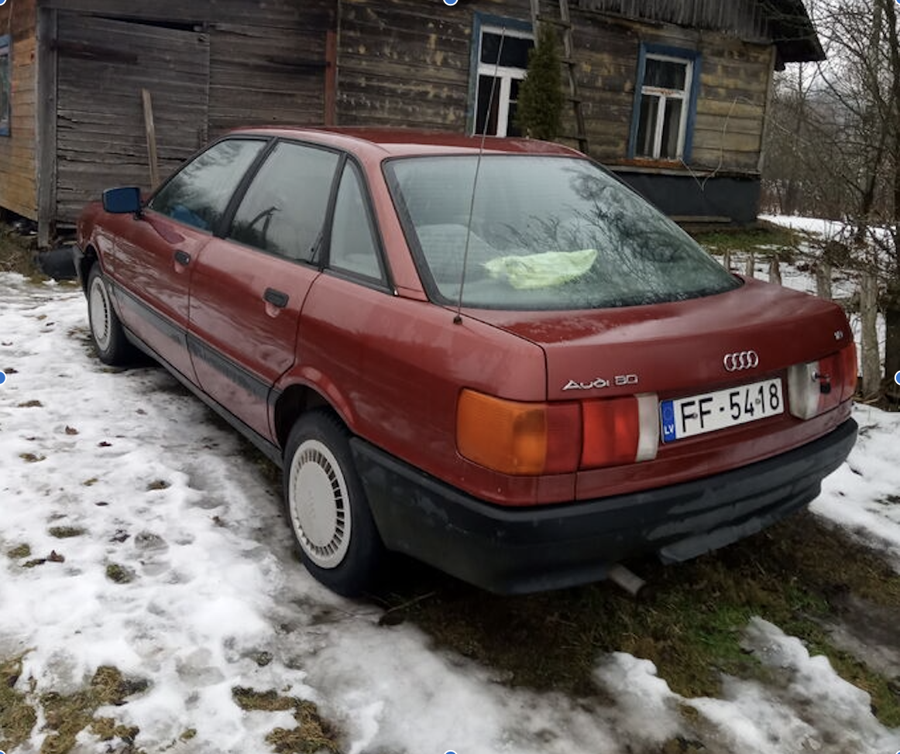
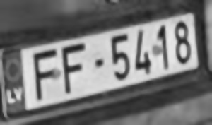

# Latvian License Plate Detection & OCR

Detect and read Latvian license plates from images using **YOLOv8** for object detection and **EasyOCR** for text recognition - all in Python.

---

  
*Original car image (example)*

  
*Cropped and processed license plate*

---

**Final detected plate:** `FF5418`

---

This script:

- Downloads one or more image URLs of the same car
- Detects the license plate using YOLOv8
- Crops and preprocesses the plate (grayscale, contrast enhancement, denoising)
- Uses EasyOCR to read the text
- Formats it for Latvian-style plates (`2 letters + 1-4 numbers`)
- Returns the most common plate across all images

**Note:** I do not claim any rights or ownership over the `license_plate_detector.pt` file. It is a pre-trained open-source model integrated into this project to handle the vehicle and plate detection logic.

Tools:

- **Python**
- **YOLOv8**: for license plate detection
- **EasyOCR**: for optical character recognition (OCR)
- **OpenCV**: for image processing
